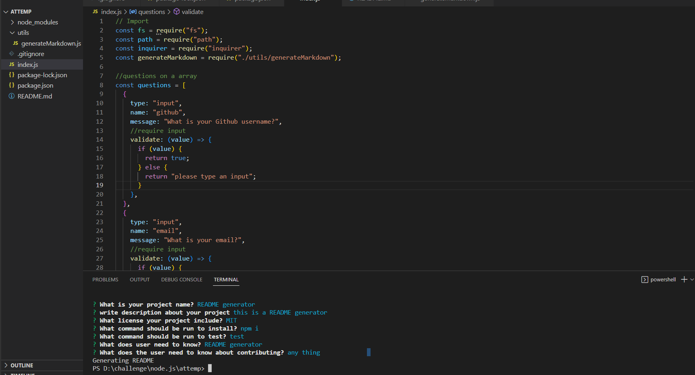
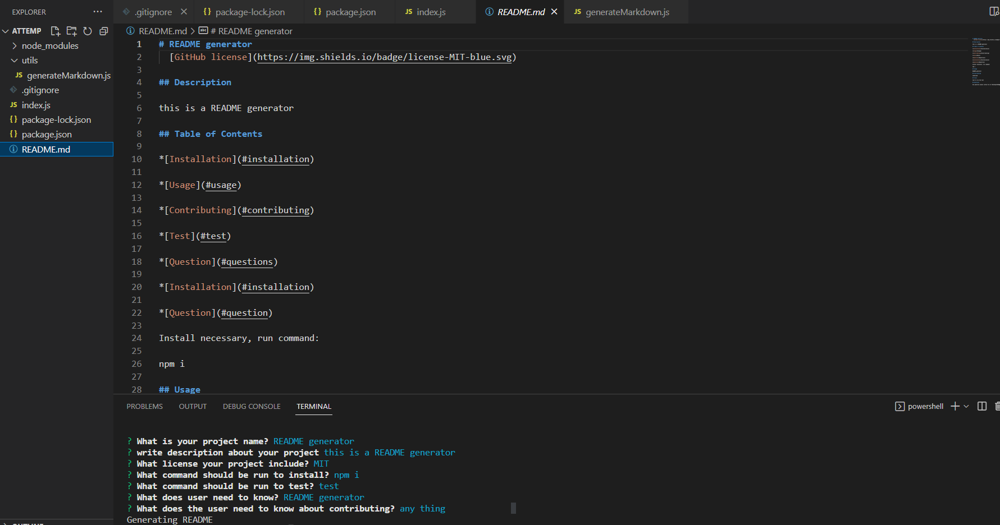

# readmeGenerator

#DESCRIPTION:

My index.js imports fs,path and inquirer from node.js

My index.js import generateMarkdown from utils

When user input nothing, my application require an input.

After running my application, I can quickly generate a detailed README file.

#URL:

https://drive.google.com/file/d/1wv4z53Z6GHJKzTcfnu9AWlmAr87gE81N/view

https://github.com/nathannguyen0102/readmeGenerator

#SCREENSHOTS:

